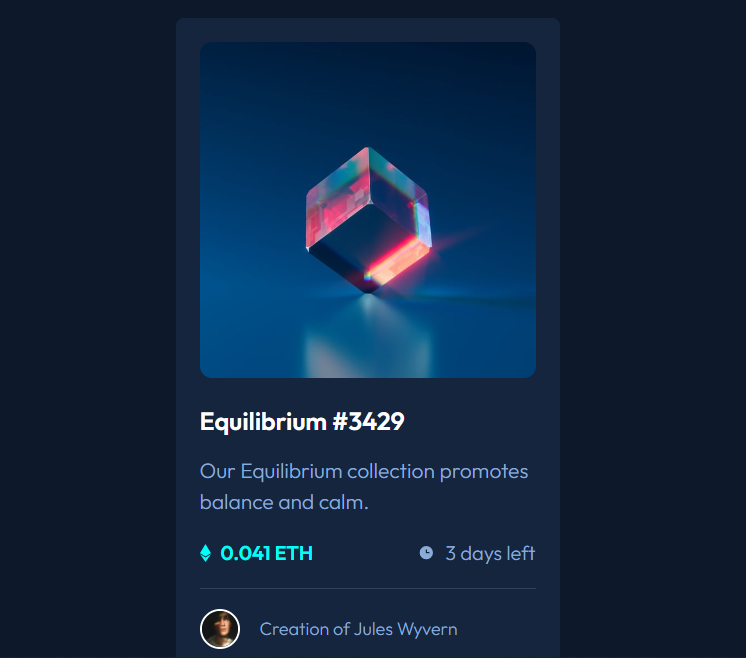

# Frontend Mentor - NFT preview card component solution

This is a solution to the [NFT preview card component challenge on Frontend Mentor](https://www.frontendmentor.io/challenges/nft-preview-card-component-SbdUL_w0U). Frontend Mentor challenges help you improve your coding skills by building realistic projects. 

## Preview
> :bulb:**[Git Pages of the Project](https://huguesmmm.github.io/frontendMentor-nftPreview/)**
[](https://huguesmmm.github.io/frontendMentor-nftPreview/)

## Table of contents

- [Overview](#overview)
  - [The challenge](#the-challenge)
  - [Screenshot](#screenshot)
  - [Links](#links)
- [My process](#my-process)
  - [Built with](#built-with)
  - [What I learned](#what-i-learned)

## Overview
### The challenge

Users should be able to:

- View the optimal layout depending on their device's screen size
- See hover states for interactive elements
## My process

### Built with

- Semantic HTML5 markup
- CSS custom properties
- Flexbox
- CSS Grid
- Mobile-first workflow
- [React](https://reactjs.org/) - JS library
- [Next.js](https://nextjs.org/) - React framework
- [Typescript](https://www.typescriptlang.org/) - JS "superset"
- [Tailwind](https://tailwindcss.com/) - CSS Framework
- [PostCSS](https://postcss.org/) - CSS tranformation tool
- [Autoprefixer](https://www.npmjs.com/package/autoprefixer) - PostCSS plugin
- [Sass](https://sass-lang.com/) - CSS preprocessor

### What I learned

I wanted to learn as much as possible with these kinds of project so I use a lot of unecessary technologies for this type of project,
like Next.js, Typescript, Tailwind and Sass.

To see how you can add code snippets, see below:

- Nesting with SCSS ("&" equals ".card" in this position)
```scss
.card{
  background: $veryDarkBlue1;
  &:hover{
    background: $cyan;
  }
}
```
- Using gap with flexbox
```scss
&-creator {
  display: flex;
  justify-content: flex-start;
  align-items: center;
  gap: 20px;
}
```
- Creating the hover effect with the eye (see boilerplate.scss)
- Using Git Pages for deployment
  1. Using the dependency gh-pages in package.json
    ```json
      "dependencies": {
        "gh-pages": "^3.2.3",
      }
    ```
  2. Using a different images loader than the default in next.config.js
    ```js
      const nextConfig = {
        images: {
          loader: 'akamai',
          path: '/',
        }
      }
    ```
  3. Use next export to create a out folder
    ```json
      "scripts": {
        "export": next export,
      }
    ```
  4. Use gh-pages to deploy using a github bot
    ```json
      "scripts": {
        "predeploy": "npm run build && npm run export",
        "deploy": "gh-pages -d out",
      }
    ```
  5. You can also create a github action that automate the deployment on github pages on each modification of the main
  ```yml
    name: Node.js CI

    on:
      push:
        branches: [ main ]
      pull_request:
        branches: [ main ]

    jobs:
      build:

        runs-on: ubuntu-latest

        strategy:
          matrix:
            node-version: [16.x]
            # See supported Node.js release schedule at https://nodejs.org/en/about/releases/

        steps:
        - uses: actions/checkout@v3
        - name: Use Node.js ${{ matrix.node-version }}
          uses: actions/setup-node@v3
          with:
            node-version: ${{ matrix.node-version }}
            cache: 'npm'
        - run: npm ci
        - run: npm run build
        - run: npm run export
        - run: touch ./out/.nojekyll
        
        - name: Deploy 🚀
          uses: JamesIves/github-pages-deploy-action@v4.3.3
          with:
            branch: gh-pages # The branch the action should deploy to.
            folder: out # The folder the action should deploy.
  ```


